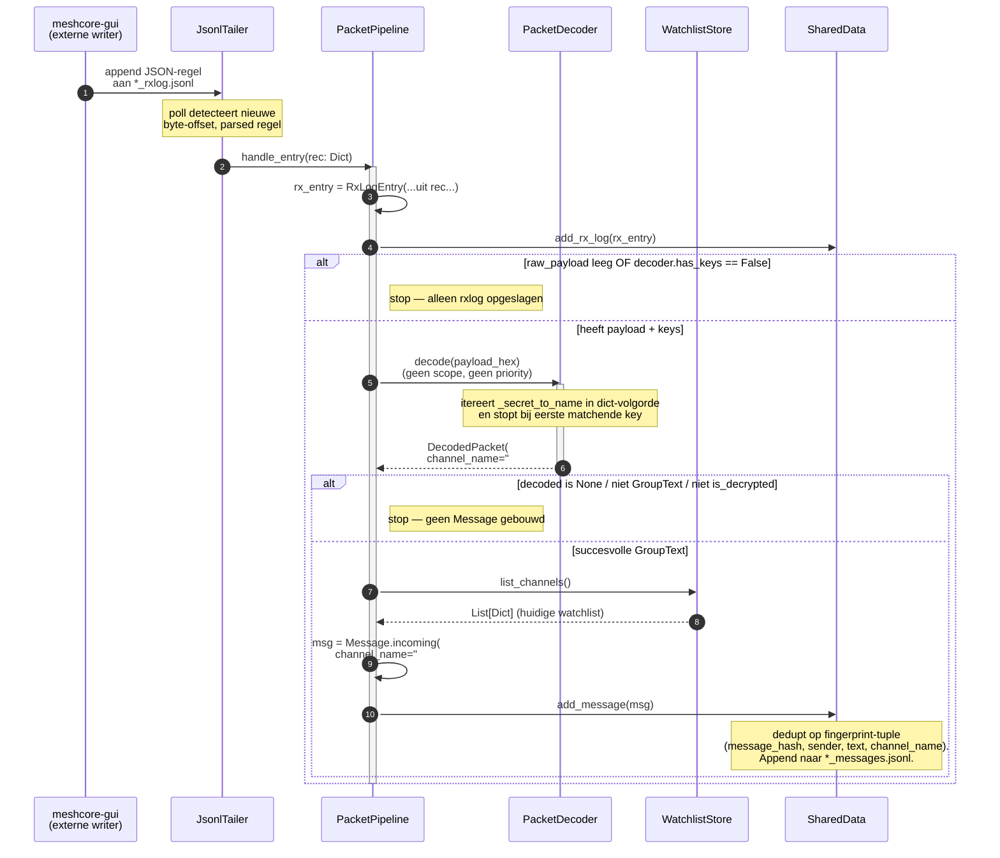
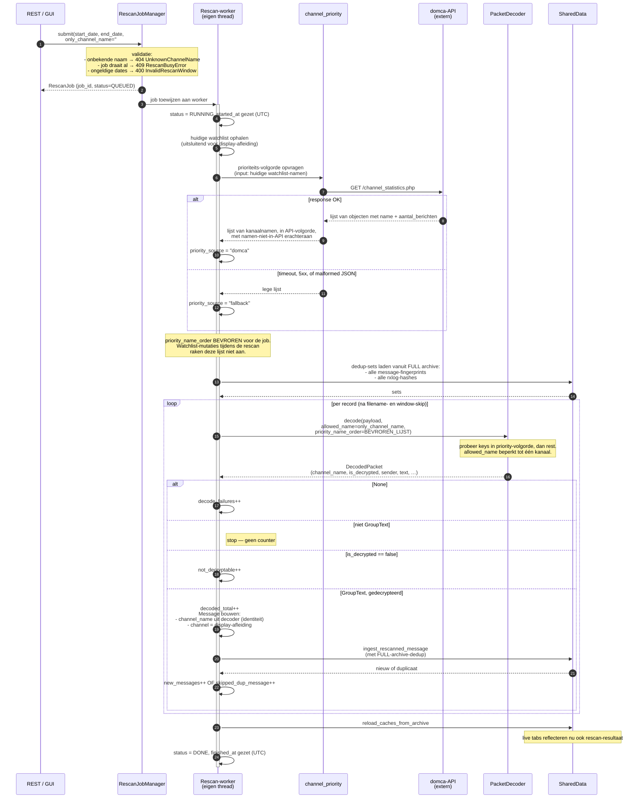

# Architectuur en logisch ontwerp — meshcore-watchlist

> **Status**: v1.0.0 · 2026-05-02
> **Doelgroep**: Python-developers die het project overnemen of uitbreiden,
> en AI-assistenten (Claude) die in latere sessies features bouwen of bugs
> verhelpen tegen deze codebase.

---

## Inhoudsopgave

1.  [Inleiding & leeswijzer](#1-inleiding--leeswijzer)
2.  [Architectuurprincipes](#2-architectuurprincipes)
3.  [Lagen en afhankelijkheidsrichting](#3-lagen-en-afhankelijkheidsrichting)
4.  [Threading-model](#4-threading-model)
5.  [Het decode-pad (live-tail)](#5-het-decode-pad-live-tail)
6.  [Het rescan-pad](#6-het-rescan-pad)
7.  [Watchlist-management](#7-watchlist-management)
8.  [Persistent storage](#8-persistent-storage)
9.  [REST API](#9-rest-api)
10. [Externe afhankelijkheden](#10-externe-afhankelijkheden)
11. [Configuratie & start-up](#11-configuratie--start-up)
12. [Uitbreidingspunten](#12-uitbreidingspunten)
13. [Bewuste niet-keuzes (anti-features)](#13-bewuste-niet-keuzes-anti-features)
14. [Bekende valkuilen voor de architectuur](#14-bekende-valkuilen-voor-de-architectuur)
15. [Verwijzingen](#15-verwijzingen)

---

## 1. Inleiding & leeswijzer

### 1.1 Wat staat er in dit document

Dit document beschrijft de **architectuur** en het **logisch ontwerp** van
`meshcore-watchlist`. Het gaat in op de vraag *"waarom is dit zo gebouwd,
hoe werkt het binnenin, en wat zijn de afwegingen achter de gemaakte
keuzes"*. Het is bedoeld als referentie voor wie de codebase wil begrijpen
voorbij het niveau van de README.

`meshcore-watchlist` is een Python-daemon plus NiceGUI-dashboard die
hashtag-kanalen op een MeshCore mesh-radio-netwerk lokaal monitort. De
service draait náást `meshcore-gui` (op dezelfde host of een andere),
leest diens append-only JSONL rx-log, ontcijfert binnenkomende
`GroupText`-packets met lokaal-afgeleide kanaalkeys, en biedt een eigen
GUI plus een REST API waarvan de response-shapes byte-voor-byte identiek
zijn aan die van `meshcore-gui`.

### 1.2 Wat staat er níet in

| Onderwerp                                    | Waar wél                              |
|----------------------------------------------|---------------------------------------|
| Snel installeren                             | `README.md`                           |
| Bindende regels en checkpoints voor sessies  | `CLAUDE.md` (repo-root)               |
| Functionele beschrijving (use cases, flows)  | `docs/fto.md`                         |
| Datavelden in detail                         | `docs/datadictionary.md`              |
| Wijzigingen per release                      | `CHANGELOG.md`                        |
| Architecture Decision Records                | `docs/adr/ADR-NNN-*.md`               |
| Release-specifiek ontwerp 0.2.6              | `docs/ontwerp/ontwerp-0.2.6.md`       |

`README.md` geeft de plattegrond voor de operator; **dit document
beschrijft het bouwwerk** voor de developer.

### 1.3 Leesvolgorde

- **Eerste kennismaking**: hoofdstukken 1 → 4 (principes, lagen,
  threading).
- **Een feature toevoegen**: hoofdstuk 12 (uitbreidingspunten) plus de
  domein-secties die de feature raakt.
- **Bug in het decode- of rescan-pad**: hoofdstukken 5 en 6.
- **Vraagstuk over compatibility met meshcore-gui**: hoofdstuk 9 plus
  10.1.
- **Voor Claude bij twijfel**: hoofdstuk 13 (anti-features) en 14
  (valkuilen) bevatten expliciete WEL/NIET-formuleringen.

### 1.4 Conventies in dit document

- Code, paden en class-namen in `monospace`.
- Citaten uit de codebase staan in fenced code-blocks.
- ⚠ markeert een keuze die *bewust afwijkt* van de gangbare
  Python-conventie en die je dus niet "moet corrigeren".
- 🔒 markeert een security-relevante keuze.
- 🧵 markeert een keuze die de threading-discipline raakt.

### 1.5 Een centrale invariant

Eén invariant vormt de ruggengraat van álle ontwerpkeuzes in dit
document. Hij staat hier vooraan zodat geen enkele lezer hem kan missen:

> **`channel_name` is de stabiele identiteit van een kanaal.** Overal in
> de codebase — decoder, dedup-fingerprint, rescan-scope, REST-paden,
> priority-volgorde — wordt een kanaal aangeduid via zijn naam. De naam
> is stabiel over watchlist-mutaties (toevoegen, verwijderen, herordenen);
> de positie van een kanaal in de UI-lijst niet. Zie ADR-001 voor de
> volledige motivatie.

Het integerveld `Message.channel` bestaat ook, maar is **uitsluitend een
display-attribuut** voor compatibility met de meshcore-gui-payload-shape;
het wordt afgeleid uit `channel_name` op moment van ingest en mag `None`
zijn. Het is **geen** sleutel, **geen** scope-parameter, **geen**
priority-element en **geen** dedup-component.

---

## 2. Architectuurprincipes

Vijf overstijgende principes bepalen hoe de codebase is ingedeeld. Elke
beslissing in latere hoofdstukken kan worden teruggevoerd op één van deze
vijf.

### 2.1 Naam-leidende identiteit (ADR-001)

Een kanaal is overal in het systeem geïdentificeerd via zijn naam. Het
gevolg is dat alle datastructuren, parameters en API-paden die naar een
kanaal verwijzen werken met `str`-namen, niet met `int`-posities.

Een paar concrete consequenties:

- De decoder-key-tabel is `Dict[secret_hex, channel_name]` — een naam
  per geregistreerd geheim.
- De dedup-fingerprint van een `Message` bevat `channel_name`.
- De rescan-scope is `only_channel_name: Optional[str]`.
- De REST-route voor per-channel-rescan is
  `POST /api/v1/rescan/by-name?channel_name=…`, met `#` URL-encoded.
- De priority-volgorde is `List[str]`.

Wat dit principe oplevert: een gebruiker mag zijn watchlist tijdens de
draaiende service vrij muteren — toevoegen, verwijderen, herordenen —
zonder dat decode-resultaten of dedup-state corrumperen. Een kanaal dat
op rij 5 stond en daarna naar rij 2 wordt versleept blijft hetzelfde
kanaal, met dezelfde geschiedenis, omdat zijn naam niet meebewoog.

### 2.2 Eén pakket, één entrypoint

De service is georganiseerd als één Python-package (`meshcore_watchlist/`)
met flat-layout (ADR-003). Er is precies één entrypoint, `main.py`, dat
de afzonderlijke componenten construeert, met elkaar verdraadt en de
NiceGUI-eventloop start. Geen aparte daemon, geen aparte API-process —
de NiceGUI-applicatie hosteert óók het FastAPI-routerendpoint waarop
`/api/v1/*` luistert.

Eén entrypoint plus één eventloop maakt het deployment simpel: één
systemd-unit, één poort, één geheugen-image. Een operator die
`systemctl status meshcore-watchlist` doet, ziet de hele service in één
oogopslag.

⚠ **Consequentie voor refactors**: voorstellen als "laten we de REST
API in een aparte gunicorn-process trekken" zijn buiten scope en moeten
worden afgewezen. De huidige opzet werkt voor de schaal waarop deze
service draait (één watchlist met enkele tot enkele tientallen kanalen).

### 2.3 Geen ORM, geen externe DB — append-only JSONL

State leeft in twee soorten opslag:

- **In-memory** in `SharedData` voor de live UI: laatste 500 messages,
  laatste 50 rx-log entries, fingerprints voor dedup.
- **Op disk** in append-only JSONL-bestanden onder
  `~/.meshcore-watchlist/archive/` — alle historie, voor replay bij
  startup en voor rescan.

Geen SQLite, geen Postgres, geen Redis. Eén tekstbestand per stroom
(`*_messages.jsonl` voor decoded berichten, `*_rxlog.jsonl` voor rauwe
rx-log entries), één JSON-record per regel. Het is leesbaar met
`jq`, `grep`, `tail` — ook drie jaar nadat de auteur weg is. Zie §8.

🔒 **Beveiligingsgevolg**: er is geen database-credential om te
beheren, te lekken of te roteren. De service heeft alleen lokale
filesystem-toegang nodig.

### 2.4 Compatibele REST-shape met meshcore-gui

De endpoints onder `/api/v1/*` produceren response-payloads die
byte-voor-byte gelijk zijn aan die van `meshcore-gui`. Dit is geen
"toevallig vergelijkbaar" — het is contractueel.

De reden: bestaande downstream consumenten (met name `domca.nl`) pollen
`meshcore-gui` met een vaste polling-logica. Door dezelfde shape te
leveren kunnen zij `meshcore-watchlist` als extra bron gebruiken zonder
codewijziging — alleen een URL-toevoeging in hun configuratie. Zie §9.

⚠ **Consequentie**: een nieuw veld toevoegen aan `/api/v1/messages`
mag (additieve evolutie), maar een bestaand veld hernoemen, schrappen
of van type wijzigen breekt downstream. Alleen na expliciet akkoord
van de domca.nl-maintainer.

### 2.5 KISS wint van SOLID waar SOLID overshoot (ADR-005)

SOLID is leidraad, geen wet. Op de schaal van dit project (één
package, ~5000 regels Python, ≤10 productie-channels per typische
watchlist) kost een Protocol-met-één-implementatie meer leesbaarheid
dan het oplevert.

Concrete uitwerking:

- Eén `PacketDecoder`-class, geen `IDecoder`-interface.
- Eén `WatchlistStore`-class, geen abstract-store-laag.
- Eén `MessageArchive`-class, geen storage-strategie-pattern.
- Eén `SharedData` met één `threading.Lock`, geen lock-per-collection.

Op het moment dat een tweede concrete implementatie nodig is (bv. een
in-memory `WatchlistStore` voor tests die het file-IO niet wil) kan de
abstractie alsnog worden geïntroduceerd. Dat moment is nog niet
aangebroken.

⚠ **Consequentie**: voorstellen als "laten we voor de testbaarheid
een `IDecoder`-interface invoegen" worden afgewezen tenzij de tweede
implementatie tegelijk wordt aangeleverd.

---

## 3. Lagen en afhankelijkheidsrichting

### 3.1 De vijf lagen

```
┌────────────────────────────────────────────────────────────────────┐
│ 1. gui/                                                            │  presentatie
│    dashboard.py, panels/                                           │
├────────────────────────────────────────────────────────────────────┤
│ 2. api/                                                            │  applicatie
│    routes.py (FastAPI blueprints onder /api/v1/*)                  │
├────────────────────────────────────────────────────────────────────┤
│ 3. services/                                                       │  domein
│    jsonl_tailer, archive_rescanner, message_archive,               │
│    watchlist_store, channel_priority, public_api_service           │
├────────────────────────────────────────────────────────────────────┤
│ 4. decoder/  ┃  core/                                              │  infrastructuur
│    packet_   ┃    models (dataclasses), shared_data                │
│    decoder   ┃                                                     │
├────────────────────────────────────────────────────────────────────┤
│ 5. config.py + main.py                                             │  bootstrap
└────────────────────────────────────────────────────────────────────┘
```

### 3.2 Afhankelijkheidsregels

Afhankelijkheden wijzen **naar beneden**: een hogere laag mag importeren
uit een lagere, nooit andersom. Concreet:

- `gui/` mag `api/`, `services/`, `core/`, `config` importeren.
- `api/` mag `services/`, `core/`, `config` importeren — geen `gui/`.
- `services/` mag `decoder/`, `core/`, `config` importeren — geen `gui/`,
  geen `api/`.
- `decoder/` en `core/` mogen alleen `config` importeren — geen `services/`.

`main.py` instantieert alle componenten en doet de wiring (dependency
injection). Het is de enige plek waar de hele dependency-graaf zichtbaar
is. Zie §11.2 voor de boot-volgorde.

### 3.3 Folder-structuur

```
~/projects/meshcore-watchlist/
├── meshcore_watchlist/
│   ├── __init__.py
│   ├── main.py             ← entrypoint + PacketPipeline
│   ├── config.py           ← paden, defaults, env-overrides
│   ├── core/
│   │   ├── models.py       ← Message, RxLogEntry, Contact, …
│   │   └── shared_data.py  ← thread-safe in-memory state
│   ├── decoder/
│   │   └── packet_decoder.py
│   ├── services/
│   │   ├── jsonl_tailer.py
│   │   ├── archive_rescanner.py
│   │   ├── message_archive.py
│   │   ├── watchlist_store.py
│   │   ├── channel_priority.py
│   │   └── public_api_service.py
│   ├── api/
│   │   └── routes.py
│   └── gui/
│       ├── dashboard.py
│       └── panels/
├── tools/
│   └── channel_injector/    ← out-of-process helper, los van de daemon
├── docs/
├── install_script/
├── tests/
├── requirements.txt
├── README.md
├── CHANGELOG.md
├── LICENSE
└── CLAUDE.md
```

`PacketPipeline` woont uitzonderlijk in `main.py` in plaats van in
`services/`. Reden: het is puur wiring tussen de tailer (services), de
decoder (decoder) en SharedData (core), zonder eigen state of beleid.
Het in een eigen service-bestand zetten zou een lege wrapper-laag
opleveren die KISS (ADR-005) schendt.

---

## 4. Threading-model

### 4.1 De drie threads

`meshcore-watchlist` draait drie threads tegelijk:

| Thread             | Eigenaar                       | Wat doet hij                                                    |
|--------------------|--------------------------------|-----------------------------------------------------------------|
| **GUI**            | NiceGUI eventloop              | UI-events, watchlist-mutaties, render-tick, REST-handlers.      |
| **Live-tail**      | `JsonlTailer._run`             | Polled `*_rxlog.jsonl` van meshcore-gui, callback per regel.    |
| **Rescan-worker**  | `RescanJobManager._worker`     | Verwerkt rescan-jobs uit een queue, één tegelijk.               |

De GUI-thread is óók de thread die FastAPI-routes afhandelt — NiceGUI
en FastAPI delen één async eventloop. Een REST-call die op `SharedData`
leest gaat dus over dezelfde async-context als de GUI-render.

🧵 De live-tail-thread en de rescan-worker-thread zijn **synchrone**
Python-threads (`threading.Thread`), niet async tasks. Reden: ze blokkeren
op file-IO en op decoder-werk; in de async-eventloop trekken zou de
GUI-render bevriezen.

### 4.2 Lock-strategie

Drie objecten houden een lock:

- `SharedData.lock` — beschermt de in-memory data-structures (messages,
  rx-log, fingerprint-sets, watchlist-cache).
- `WatchlistStore._lock` — beschermt de in-memory channel-lijst en
  serializeert het schrijven naar `watchlist.json`.
- `MessageArchive._lock` — beschermt de write-buffers per stroom en
  serializeert atomic-renames bij retention-cleanup.

Elk object heeft één eigen lock. Er is geen globale lock en geen
gedeelde lock tussen objecten. De volgorde waarin een caller meerdere
locks pakt is altijd: `WatchlistStore._lock` (kortste, meestal niet
genest) → `SharedData.lock` (meestal het buitenste lock) →
`MessageArchive._lock` (meestal binnenin SharedData-operaties als
gevolg van een append). In de praktijk neemt geen enkele method twee
locks tegelijk; alle interlock-communicatie loopt via callbacks of
return-waarden.

🧵 **Geen RLock.** Alle locks zijn `threading.Lock`, niet `RLock`. Er is
geen reentrant access-pattern; een poging om dezelfde lock recursief te
nemen wijst op een foute call-graph en moet worden opgelost door
herstructurering, niet door de lock op te waarderen.

### 4.3 Waarom géén RLock

`RLock` is een lock die door dezelfde thread meerdere keren genomen kan
worden. Dat klinkt veilig, maar maskeert reentrancy-bugs: een methode
die per ongeluk een andere methode op hetzelfde object aanroept onder
de lock zou met `Lock` direct deadlocken (signaal: bug), met `RLock`
gewoon doorlopen (signaal: niets, maar invariants kunnen midden-update
gelezen worden door de geneste call).

In dit project is geen enkel publiek pad reentrant-onder-lock; alle
interne helpers die *binnen* een locked-block lopen zijn private en
slot-vrij. Dat patroon is alleen houdbaar met `Lock`, niet met `RLock`.

### 4.4 Watchlist-mutaties tijdens een rescan

Een gebruiker mag tijdens een lopende rescan-job vrijuit de watchlist
muteren — toevoegen, verwijderen, herordenen. Het systeem moet daarop
correct reageren:

- **Toevoegen** van een kanaal `#nieuw`: de decoder-key-tabel krijgt
  direct (via `_on_watchlist_changed`) de nieuwe key. Records die de
  rescan daarna verwerkt en die met `#nieuw` gedecodeerd kunnen worden,
  matchen.
- **Verwijderen** van een kanaal `#oud`: de decoder-key-tabel verliest
  direct de key. Records die de rescan daarna verwerkt en die alleen met
  `#oud` zouden matchen vallen onder `not_decryptable`.
- **Herordenen**: heeft *geen enkel effect* op de rescan. De rescan
  identificeert kanalen via naam; geen herordening verandert namen.

Wat **niet** mag wijzigen tijdens de rescan: de
`priority_name_order`-lijst die de job aan het begin opvroeg. Die is
bevroren voor de duur van de job — anders zou de optimalisatie van
"probeer de meest-waarschijnlijke keys eerst" ruis krijgen door
mid-job-herrangschikking. Zie §6.2 voor de motivatie.

### 4.5 GUI-thread blokkering

Eén regel: **de GUI-thread mag niet blokkeren**. Geen `time.sleep`,
geen synchrone HTTP-calls, geen file-IO langer dan een paar
milliseconden. Alle wachtende of langzame operaties leven in de
live-tail- of de rescan-worker-thread.

Concreet:

- De Domca-API call (HTTP GET met 5s timeout) wordt uitgevoerd door de
  rescan-worker bij job-start, niet door de GUI-thread.
- De append-only writes naar de archive-JSONL gebeuren door de
  thread die de append triggert (de tailer-thread bij live, de
  worker-thread bij rescan), maar `MessageArchive` flusht in batches
  zodat individuele writes geen disk-sync triggeren.
- De render-tick van NiceGUI gebruikt `clear_update_flags()` op
  SharedData om te zien of er nieuwe data is — dat is een lock-acquire
  + paar boolean-toewijzingen, geen IO.

---

## 5. Het decode-pad (live-tail)

Dit is het pad dat in productie ongeveer 99% van de tijd actief is.

### 5.1 Sequence diagram



### 5.2 Wat dit diagram bewijst

- **De decoder weet van geen positie.** Aan stap 6 gaat alleen
  `payload_hex` (en optioneel naam-gebaseerde parameters) naar binnen,
  en alleen `channel_name` plus payload-velden komen eruit.
- **Naam → display-positie gebeurt op één plek, na het decoderen.**
  Stap 12. Als de gebruiker net dat kanaal verwijderd heeft, is het
  display-veld simpelweg `None` — het bericht wordt nog steeds
  bewaard, alleen zonder huidige positie-context.
- **Het pad raakt nooit `state.json`.** De live-tail beweegt alleen
  zijn eigen byte-offset cursor in `state.json`; het rescan-pad
  (§6) raakt deze cursor uitdrukkelijk niet, zodat live-tail en
  rescan elkaar niet bijten.

### 5.3 Foutpaden in het decode-pad

| Conditie                                       | Gedrag                                          |
|------------------------------------------------|-------------------------------------------------|
| `*_rxlog.jsonl` nog niet aanwezig              | Tailer logt en blijft pollen.                   |
| File-truncate / rotate (size < cursor)         | Cursor reset naar 0; dedup absorbeert re-emit.  |
| Regel parsen mislukt (malformed JSON)          | Regel skippen, log naar stderr, doorgaan.       |
| `raw_payload` leeg                             | Alleen `RxLogEntry` opslaan, geen decode.       |
| Decoder heeft geen keys (lege watchlist)       | Alleen `RxLogEntry` opslaan, geen decode.       |
| Structurele decode-error in `MeshCoreDecoder`  | Return `None` — geen exception bubbelt op.      |
| Geen key matcht                                | `DecodedPacket(is_decrypted=False)`; geen Message. |
| Fingerprint zat al in dedup-set                | Niet opnieuw appenden of toevoegen aan ring.    |

### 5.4 In-memory caps en archive-replay

`SharedData` houdt twee ringbuffers met vaste grootte:

- `messages`: `MAX_MESSAGES = 500` — de laatste 500 voor de UI.
- `rx_log`: `MAX_RX_LOG = 50` — de laatste 50 voor de RX-tab.

Elke append boven de cap leidt tot `self.messages = self.messages[-500:]`
(slice-en-vervang). Het archive op disk groeit ondertussen onbegrensd —
alleen de retentie-cleanup (§8.4) snoeit dat dagelijks.

Bij startup leest `_load_from_archive` de laatste cap-aantal records uit
de JSONL-archives in een streaming-pass (geen volledige load), zodat de
GUI na een herstart direct gevuld is. Dezelfde routine wordt aangeroepen
ná een rescan-job (`reload_caches_from_archive`) zodat berichten die de
rescan uit historische packets ontcijfert, ook in de live UI-tabs
verschijnen.

---

## 6. Het rescan-pad

Een rescan herleest het volledige `*_rxlog.jsonl`-archief (of dat van
één kanaal) over een expliciet datumvenster, en probeert opnieuw te
ontcijferen — typisch nadat een nieuw kanaal aan de watchlist is
toegevoegd waar historische packets voor liggen.

### 6.1 Sequence diagram



### 6.2 Bevroren priority order, levende keys

Twee dingen die op het eerste gezicht hetzelfde lijken, maar verschillende
levensduren hebben:

| Eigenschap                       | Bevroren bij job-start? | Volgt watchlist-mutatie? |
|----------------------------------|-------------------------|--------------------------|
| `priority_name_order` per job    | ja                      | nee                      |
| `_secret_to_name` in de decoder  | nee                     | ja                       |

Waarom dit verschil? `priority_name_order` is een **optimalisatie**:
"probeer de meest-waarschijnlijke keys eerst, zodat de break-on-first-match
vroeg vuurt en we 50 miljoen AES-pogingen besparen op een 426-channel
install". Het is geen correctheidsmechanisme. Tijdens een job de volgorde
herrangschikken kost de optimalisatie haar deterministische verklaring
(welk record kreeg welke positie?), zonder iets aan correctheid bij te
dragen.

`_secret_to_name` is daarentegen **functionaliteit**: een kanaal toevoegen
betekent "vanaf nu wil ik berichten op dit kanaal kunnen ontcijferen, ook
in records die de lopende rescan nog moet verwerken". Dat moet live
volgen.

Dat deze twee verschillende levensduren netjes samenwerken is het directe
gevolg van naam-leidende identiteit: de prioriteits-lijst is een lijst
**namen**, dus de ordening blijft betekenisvol ook als de volgorde van de
watchlist-positions verandert.

### 6.3 Filename- en window-skip

Een rescan over een meerjarig archief is potentieel duur. Twee skip-lagen
beperken het werk:

1. **Filename-skip.** `meshcore-gui` hanteert filenames als
   `_dev_<addr>_2026-04-15_rxlog.jsonl`. Een file waarvan de
   YYYY-MM-DD-component buiten het rescan-venster valt wordt zonder open
   geskipt. Files zonder eenduidige datum in de naam (met name
   `*_rxlog.json`-snapshots) vallen door naar laag 2.
2. **Record-skip op timestamp.** Een record waarvan `time` buiten het
   venster valt wordt overgeslagen na de structurele decode maar vóór de
   per-key decryptie. Dat scheelt het AES-werk per skipped record.

De combinatie maakt een rescan op een paar dagen op een meerjarig
archief praktisch lineair in het aantal records *binnen* het venster.

### 6.4 Per-record tellers

De rescan-job houdt zes tellers bij die in de GUI tijdens de rescan
zichtbaar worden:

| Teller                    | Wanneer geïncrementeerd                                         |
|---------------------------|------------------------------------------------------------------|
| `decoded_total`           | GroupText is succesvol ontcijferd (= `new_messages` + `skipped_dup_message`). |
| `new_messages`            | Decoded én niet in archive — toegevoegd aan archive.            |
| `skipped_dup_message`     | Decoded én al in archive (op fingerprint).                       |
| `not_decryptable`         | GroupText, geen key matchde.                                     |
| `new_rxlog`               | RxLogEntry niet in archive — toegevoegd.                         |
| `skipped_dup_rxlog`       | RxLogEntry al in archive (op `message_hash`).                    |
| `skipped_window`          | Record-timestamp buiten venster.                                 |
| `skipped_files`           | Filename-datum buiten venster (filename-skip).                   |
| `decode_failures`         | Structureel ongeldig packet (parse-error in decoder).            |

Met deze drie naast elkaar — `decoded_total`, `not_decryptable`,
`new_messages` — is op het scherm te zien of "+0 nieuwe berichten"
betekent *"alles werkte, niets was nieuw"* of *"niets werkte"*.

### 6.5 Foutpaden in het rescan-pad

| Conditie                                            | Gedrag                                                |
|-----------------------------------------------------|-------------------------------------------------------|
| Source-archive directory bestaat niet               | Job → `FAILED`, error gezet, geen records verwerkt.   |
| Domca-API onbereikbaar / 5xx / malformed            | `priority_source = "fallback"`, lege priority-lijst — rescan loopt door. |
| `allowed_name` niet (meer) in decoder-registry      | Decoder retourneert `None` — record valt onder `decode_failures`. |
| Decoder-error op één record                         | `decode_failures++`, doorgaan op de volgende.        |
| `SharedData` zonder archive aangesloten             | Job → `FAILED` direct.                                |
| Watchlist leeg                                      | Decoder heeft geen keys — alle records vallen onder `not_decryptable`. Job kan succesvol eindigen met 0 nieuwe berichten. |

Een failed Domca-call is **expliciet geen** failed job. Het is een
optimalisatie-input; haar uitval is een *graceful degradation* naar
fallback-volgorde.

---

## 7. Watchlist-management

### 7.1 WatchlistStore als bron-van-waarheid

`WatchlistStore` is de enige plek waar watchlist-state geleefd wordt.
De file `~/.meshcore-watchlist/watchlist.json` is de persistente
representatie; in-memory wordt een lijst van `Dict[str, Any]` bijgehouden
met de huidige snapshot.

Schema van het bestand:

```json
{
    "version": 1,
    "channels": [
        {"idx": 0, "name": "Public"},
        {"idx": 1, "name": "#mc-radar"},
        {"idx": 2, "name": "#weather"}
    ]
}
```

Het `idx`-veld in dit bestand is een UI-positie (de rij waarop een
gebruiker dit kanaal in zijn dashboard ziet); het heeft binnen het
systeem geen rol als sleutel of identiteit. Zie §7.5 voor het volledige
verhaal.

### 7.2 Notify-mechanisme

`WatchlistStore.subscribe(callback)` registreert een callable die bij
elke wijziging een snapshot van de huidige channel-list ontvangt.
`PacketPipeline._on_watchlist_changed` is geabonneerd: bij elke wijziging
synchroniseert het de decoder-key-tabel (delta-update: alleen toevoegen
en verwijderen, nooit volledig herbouwen).

**Waarom delta in plaats van clear+rebuild**: tijdens een lopende rescan
zou een clear+rebuild een transient leeg moment in `_secret_to_name`
opleveren waarin een decode-pas geen enkele key zou zien. Met delta is
de registry op elk moment óf de oude staat óf de nieuwe — nooit leeg
tussendoor.

### 7.3 Public-channel uitzondering

De MeshCore-Public-channel volgt **niet** de
`SHA-256(name.encode())[:16]`-derivation die hashtag-channels gebruiken.
Public heeft een vast, well-known 16-byte secret dat in de firmware
hard-coded is (`PUBLIC_CHANNEL_SECRET_HEX` in `config.py`).

In de pipeline:

- Bij `add` van een channel met naam `"Public"` (case-insensitive)
  registreert de decoder die specifieke 16-byte-secret.
- Bij `add` van een channel met naam `"#anything"` derivt de decoder
  het secret als `SHA-256("#anything".encode())[:16]`.

🔒 De Public-secret is openbaar (staat in firmware-source en in
publieke decoder-implementaties). Encryptie van Public-traffic is bij
ontwerp niet vertrouwelijk — Public is letterlijk "iedereen op het
mesh kan dit lezen". `meshcore-watchlist` registreert het secret puur
om de berichten te kunnen *parsen*; er is geen security-claim aan
verbonden.

### 7.4 Hashtag-derivation

Voor hashtag-channels (`#xxx`) is de derivation:

```python
secret_bytes = sha256(channel_name.encode("utf-8")).digest()[:16]
```

De naam — inclusief het `#` — gaat in de hash. Dat betekent dat
`#test` en `test` verschillende secrets hebben; de `WatchlistStore`
forceert daarom `#`-prefix bij `add` zodat een gebruiker geen
"test"-zonder-hash per ongeluk in zijn lijst zet en zich daarna
afvraagt waarom er niets ontcijferd wordt.

### 7.5 De `idx` — wat het is en wat het niet is

Het integerveld `idx` komt op drie plekken voor in de codebase:

- In `watchlist.json` (per channel-record).
- In `Message.channel: Optional[int]` (display-afleiding).
- Als parameter van `WatchlistStore.remove(idx: int)` — een GUI-affordance
  ("verwijder de rij die in de UI op deze positie staat").

Op deze drie plekken **is het uitsluitend een UI-positie**. Het is:

- ❌ niet de identiteit van een kanaal — dat is `channel_name`.
- ❌ niet een sleutel in de decoder — die is keyed op `_secret_to_name`.
- ❌ niet een component van de dedup-fingerprint — die is `(message_hash,
  sender, text, channel_name)`.
- ❌ niet een scope-parameter voor rescan — dat is `only_channel_name`.
- ❌ niet een element van de priority-lijst — die is `List[str]`.
- ❌ niet een component van een REST-pad — endpoints gebruiken
  `?channel_name=…`.

Wie een nieuwe feature ontwerpt en zich afvraagt "moet ik hier `idx`
of `channel_name` gebruiken": het antwoord is **vrijwel altijd**
`channel_name`. De enige uitzondering is een puur UI-/display-context
waarin een rij-nummer wordt getoond.

---

## 8. Persistent storage

### 8.1 De data root

Alle persistente staat van `meshcore-watchlist` leeft onder
`~/.meshcore-watchlist/`:

```
~/.meshcore-watchlist/
├── watchlist.json                        ← CRUD via UI
├── state.json                            ← tailer byte-offset cursors per source-file
└── archive/
    ├── <device-id>_messages.jsonl        ← gedecodeerde Message-records
    ├── <device-id>_rxlog.jsonl           ← rauwe RxLogEntry-records
    ├── <device-id>_messages.json.migrated-v1   ← (alleen na 0.2.4-upgrade)
    └── <device-id>_rxlog.json.migrated-v1      ← (alleen na 0.2.4-upgrade)
```

De `<device-id>` is de identifier waarmee `meshcore-gui` zijn
files schrijft (typisch `_dev_<address>`); `MessageArchive`
sanitizeert deze naar een filesystem-veilige basenaam.

### 8.2 Append-only JSONL

Sinds 0.2.4 is het archive in **JSON-Lines** formaat: één JSON-record
per regel, geschreven append-only. Elke flush is O(buffer-size),
ongeacht hoe groot het archive in totaal is.

⚠ **Bewuste trade-off**: een append-only-log is geen tabel. Edits zijn
niet mogelijk; correcties gebeuren door een nieuw record te appenden
met dezelfde fingerprint en latere timestamp, waarna consumers het
laatste record nemen. Dit past bij de gebruiksscenario "alles wat
binnenkomt is een feit; we vergeten niets" en niet bij "we beheren
records met CRUD-semantiek".

### 8.3 Fingerprint-dedup

Twee dedup-niveaus:

- **In-memory**, in `SharedData._message_fingerprints` /
  `_rxlog_hashes`: voorkomt dat een record dat de live-tail al gezien
  heeft, opnieuw aan de UI-ringbuffer wordt toegevoegd.
- **Op-disk**, geladen door de rescan-worker uit het FULL archive: zorgt
  dat een rescan-pas geen reeds-gearchiveerde records dupliceert.

De fingerprint-tuple voor `Message`:

```
(message_hash, sender, text, channel_name)
```

— met `channel_name` als laatste component, expliciet géén `channel`
(de positie). Voor `RxLogEntry` is het simpelweg `message_hash`.

### 8.4 Retention-strategie

De service hanteert twee retention-vensters, afgestemd op
`meshcore-gui`-defaults:

- `MESSAGE_RETENTION_DAYS = 7`
- `RXLOG_RETENTION_DAYS = 7`

Cleanup gebeurt eens per dag als een one-shot rewrite per stroom: lees
de hele JSONL, filter op timestamp, schrijf naar tijdelijke `.jsonl.tmp`,
atomic rename. Niet per insert (zoals het 0.2.3-format deed) — dat zou
opnieuw O(N²) opleveren.

### 8.5 Migratie 0.2.3 → 0.2.4

Bij eerste start van 0.2.4+ wordt een bestaand `.json` (read-merge-rewrite
formaat versie 1) eenmalig geconverteerd naar `.jsonl`: elke entry op
één regel, daarna `.json` hernoemd naar `.json.migrated-v1`. Het oude
bestand blijft staan voor recovery — niet verwijderd. Volgende starts
slaan de migratie over als er al een `.jsonl` ligt.

---

## 9. REST API

### 9.1 Endpoints en shape-compatibility

Vier read-only endpoints + drie rescan-control-plane endpoints + één
watchlist-mutation endpoint, allemaal onder `/api/v1/`:

| Endpoint                              | Methode | Beschrijving                                              |
|---------------------------------------|---------|-----------------------------------------------------------|
| `/api/v1/stats`                       | GET     | Aggregaten over de laatste 72 uur.                        |
| `/api/v1/nodes`                       | GET     | Altijd `[]` — watchlist heeft geen contact-list.          |
| `/api/v1/messages`                    | GET     | Paginated decoded berichten (`limit` 1-500, `offset` ≥0). |
| `/api/v1/channels`                    | GET     | Watchlist channel-list.                                   |
| `/api/v1/channels`                    | POST    | Voeg een kanaal toe aan de watchlist (zie §9.4).          |
| `/api/v1/rescan`                      | POST    | Submit volledige rescan over een datumvenster.            |
| `/api/v1/rescan/by-name`              | POST    | Submit per-channel rescan, gescoped op `channel_name`.    |
| `/api/v1/rescan/{job_id}`             | GET     | Status van een eerder gesubmitteerde rescan-job.          |

De vier read-only endpoints produceren payloads die byte-voor-byte
identiek zijn aan die van `meshcore-gui` (zie §2.4). De eigen
implementatie zit in `services/public_api_service.py`, bewust dicht
tegen de meshcore-gui-versie aan zodat een upstream-wijziging één-op-één
kan worden gepatcht.

### 9.2 Geen authenticatie, CORS-default

🔒 Geen authenticatie, gelijk aan `meshcore-gui`. CORS is `*` per
default; override via `MESHCORE_WATCHLIST_CORS_ORIGINS`-env. De service
bindt op `0.0.0.0:<port>` — bewust, omdat de typische deployment een
Pi-on-LAN is waar andere hosts op het LAN moeten kunnen pollen. Toegang
beperken is een operator-keuze (firewall), geen applicatie-zorg.

### 9.3 Rescan-control-plane

`POST /api/v1/rescan` (volledig) en `POST /api/v1/rescan/by-name`
(per-channel) zijn idempotent in de zin dat ze 409 retourneren als er
al een job loopt — er is geen queueing van meerdere jobs tegelijk.
`/api/v1/rescan/by-name` neemt `channel_name` als query-parameter
(URL-encoded `#` als `%23`); een path-parameter met `#` zou ambigu zijn
voor sommige proxies/clients (kan als fragment-marker gelezen worden).

Statuscodes:

| Endpoint                         | Conditie                              | Status | Body-error                       |
|----------------------------------|---------------------------------------|--------|----------------------------------|
| `POST /api/v1/rescan`            | dates ontbreken / ongeldig            | 400    | `invalid_rescan_window`          |
| `POST /api/v1/rescan/by-name`    | `channel_name` ontbreekt              | 400    | `missing_channel_name`           |
| `POST /api/v1/rescan/by-name`    | naam niet in watchlist                | 404    | `channel_name_not_in_watchlist`  |
| `POST /api/v1/rescan*`           | job loopt al                          | 409    | `rescan_busy`                    |
| `GET  /api/v1/rescan/{job_id}`   | onbekend job_id                       | 404    | `unknown_job`                    |

### 9.4 Watchlist-mutation control-plane

`POST /api/v1/channels?name=...` is het officiële kanaal voor
**out-of-process** mutaties van de watchlist. De endpoint forward
direct naar `WatchlistStore.add()`; daarmee blijft de invariant uit
hoofdstuk 7 — *de daemon is de enige mutator van de watchlist* —
intact, óók als de aanroep van een ander proces komt
(bv. `tools/channel_injector` vanuit cron). Het alternatief
"client schrijft `watchlist.json` direct" is bewust **niet**
ondersteund: dat racet met de live store en omzeilt het
notify-mechanisme uit §7.2 (decoder key-registry blijft stale).

Statuscodes:

| Endpoint                  | Conditie                                            | Status | Body                                                            |
|---------------------------|-----------------------------------------------------|--------|-----------------------------------------------------------------|
| `POST /api/v1/channels`   | nieuwe naam toegevoegd                              | 201    | `{"name": "<#name>", "added": true}`                            |
| `POST /api/v1/channels`   | naam al aanwezig                                    | 200    | `{"name": "<#name>", "added": false, "reason": "already_on_watchlist"}` |
| `POST /api/v1/channels`   | naam = `Public` (case-insensitive, met of zonder `#`) | 200    | `{"name": "Public", "added": false, "reason": "public_is_system_managed"}` |
| `POST /api/v1/channels`   | naam ontbreekt of leeg                              | 400    | `{"error": "missing_name"}`                                     |
| `POST /api/v1/channels`   | naam bevat control-chars (CR/LF, …)                 | 400    | `{"error": "invalid_name"}`                                     |
| `POST /api/v1/channels`   | naam > 32 UTF-8 bytes (zie ADR-007)                 | 400    | `{"error": "name_too_long", "max_bytes": 32, "got_bytes": N}`   |

De endpoint is **additief** sinds 0.3.0 en breekt geen bestaande
consumer: alle GET-shapes en de rescan-control-plane zijn
byte-voor-byte ongewijzigd. De endpoint registreert zich alleen als
`register_routes()` is aangeroepen met de nieuwe `store=`-keyword
(default `None`); een 0.2.x-aanroeper zonder die parameter krijgt de
endpoint dus niet, maar werkt verder identiek.

### 9.5 Pagination en het `id`-veld

`GET /api/v1/messages` paginiert via `limit` en `offset`. Het
`id`-veld in elke response-item is een lokaal nummer per response —
**geen stable primary key**, geen relatie met `channel_name` of
kanaal-identiteit. Downstream consumenten moeten dedupliceren op een
content-key (typisch `(timestamp, sender_pubkey, text)`), niet op `id`.

---

## 10. Externe afhankelijkheden

### 10.1 meshcore-gui JSONL rx-log

`meshcore-gui` schrijft per LoRa-pakket een JSON-regel naar
`~/.meshcore-gui/archive/_dev_<addr>_rxlog.jsonl`. `meshcore-watchlist`
tailt deze file met een byte-offset cursor in
`~/.meshcore-watchlist/state.json`.

**Coupling-niveau**: hoog op het record-schema (welke velden zijn er,
welke types), laag op alles eromheen (geen gedeeld geheugen, geen
gedeelde DB, geen gedeelde lock). Een upgrade van `meshcore-gui` die
record-velden hernoemt of typen wijzigt breekt deze service. De
`JsonlTailer` valideert daarom defensief en logt-en-skipt
parse-errors zonder te crashen.

**Versie-eis**: meshcore-gui v1.22.1 of nieuwer (provides het
JSONL-stream-formaat).

### 10.2 Domca-API (channel_priority)

`channel_priority.fetch_priority_name_order` doet een HTTP GET naar
`https://www.domca.nl/api/meshcore/channel_statistics.php` met
5 seconden hard-timeout. De response wordt gebruikt om een
prioriteits-volgorde van kanaalnamen op te bouwen voor de rescan-decoder.

🔒 De service moet **graceful** falen op deze externe afhankelijkheid:
timeout, 5xx, malformed JSON of een geblokkeerde uitgaande connectie
mogen de service niet stoppen of een rescan-job laten falen. Alle
HTTP-failures worden afgevangen en geconverteerd naar een lege lijst,
wat in de rescan-worker als `priority_source = "fallback"` zichtbaar
wordt.

⚠ **`urllib`, geen `requests`**: voor één GET-call met timeout is
`urllib.request` voldoende. Toevoegen van `requests` als dependency
voor één call is wegingsgewijs niet de moeite. Als ergens anders een
tweede HTTP-consument bijkomt wordt deze keuze opnieuw geëvalueerd.

### 10.3 meshcoredecoder-package

Het ontcijferen van LoRa-packets gebeurt via de externe
`meshcoredecoder`-package (Python-port van een TypeScript-decoder uit
de MeshCore-community). `PacketDecoder` wraps deze package om twee
redenen:

- De ruwe API werkt met `MeshCoreKeyStore` / `DecryptionOptions` —
  een dunne wrapper produceert een handzame `decode(payload_hex,
  allowed_name=, priority_name_order=)`-signatuur die gebruik in
  pipeline en rescanner consistent maakt.
- De wrapper houdt ook de key-registry (`_secret_to_name`) en de
  attributie-logica (welk kanaal hoort bij welke matchende key). Die
  logica wil je niet in elke caller herhalen.

Versie-eis: zoals in `requirements.txt`. Schema-wijzigingen in
`meshcoredecoder` (velden in `DecodedPacket` van die library, of in
de `decrypted`-payload) propageren via `PacketDecoder` naar de rest;
dat is een upstream-zorg om in de gaten te houden.

### 10.4 NiceGUI / FastAPI

NiceGUI is gekozen omdat het een complete Python-stack levert (server +
client + CSS-framework) zonder dat de developer JS hoeft te schrijven.
Onder de motorkap draait FastAPI op uvicorn. De REST-routes uit
`api/routes.py` worden dan ook geregistreerd op `nicegui.app` (de
FastAPI-instance), niet op een aparte FastAPI-applicatie.

`reload=False` in `ui.run` is bewust — de service heeft langlopende
background-threads (de tailer) die een reload zou orphanen.

---

## 11. Configuratie & start-up

### 11.1 Omgevingsvariabelen

Alle configuratie zit in `config.py`. De override-bare punten zijn:

| Env-variabele                       | Default                                         | Doel                                                    |
|-------------------------------------|-------------------------------------------------|---------------------------------------------------------|
| `MESHCORE_WATCHLIST_PORT`           | `8083`                                          | TCP-port waarop NiceGUI bindt.                          |
| `MESHCORE_WATCHLIST_HOST`           | `0.0.0.0`                                       | Bind-adres.                                             |
| `MESHCORE_GUI_ARCHIVE`              | `~/.meshcore-gui/archive`                       | Source-directory waar de tailer naar `*_rxlog.jsonl` zoekt. |
| `MESHCORE_WATCHLIST_CORS_ORIGINS`   | `*`                                             | CORS Origin voor `/api/v1/*`.                           |
| `MESHCORE_WATCHLIST_DEBUG`          | `0`                                             | Aan met `1`: stderr-debug-prints.                       |

`install.sh` schrijft deze waarden in de gegenereerde
systemd-unit-template, zodat de operator één bestand bewerkt en
`systemctl daemon-reload` doet.

### 11.2 De boot-volgorde

`main.main()` doet de volgende stappen, in deze volgorde:

1. `WatchlistStore()` — leest `watchlist.json`, of creëert hem met de
   standaard Public-entry als hij ontbreekt.
2. `SharedData()` — opent het `MessageArchive`, doet de migratie van
   0.2.3-format als nodig, replays de laatste cap-aantal records uit
   de JSONL-archives in de in-memory ringbuffers.
3. `PacketDecoder()` — leeg, geen keys.
4. `PacketPipeline(shared, decoder, store)` — abonneert op
   `WatchlistStore`, wat als bijwerking direct
   `_on_watchlist_changed` aanroept met de huidige snapshot. De
   decoder krijgt op dat moment al zijn keys.
5. `JsonlTailer(callback=pipeline.handle_entry).start()` — start de
   live-tail thread.
6. `ArchiveRescanner` + `RescanJobManager` — geconstrueerd, geen
   thread gestart; jobs draaien on-demand.
7. `build_dashboard(...)` — registreert de NiceGUI-tabs.
8. `register_routes(...)` — registreert de FastAPI-endpoints.
9. `ui.run(host, port, reload=False)` — blocking, start de
   eventloop. Bij `Ctrl-C` of `SIGTERM` stopt NiceGUI gracefully;
   de tailer-thread wordt door zijn `_stop_event` neergezet door
   het OS-signal-handling-pad van NiceGUI.

### 11.3 Public-channel-secret

De Public-channel-secret is een 16-byte constante in `config.py`
(`PUBLIC_CHANNEL_SECRET_HEX`). Als de MeshCore-firmware ooit deze
waarde roteert, hoeft maar één plek aangepast te worden. Op dit moment
is daar geen indicatie voor.

---

## 12. Uitbreidingspunten

### 12.1 Een nieuwe REST-endpoint

1. Implementeer de payload-bouwer in `services/public_api_service.py`.
2. Registreer een handler in `api/routes.py` met dezelfde decorator-stijl
   als de bestaande endpoints. Gebruik `_cors_response` om de
   CORS-headers consistent te houden.
3. Update `docs/datadictionary.md` met de response-shape.

Alleen toevoegen aan `/api/v1/*`-prefix als de endpoint óf nieuw is in
beide werelden (niet in meshcore-gui), óf dezelfde shape produceert als
diens equivalent. Een nieuwe shape onder een nieuwe prefix
(bv. `/api/v2/`) is een productiekeuze die domca-coördinatie vereist.

### 12.2 Een nieuw GUI-paneel

NiceGUI-panels in `gui/panels/`. Een nieuw paneel:

1. Maakt zijn UI in een `with ui.card():`-context.
2. Leest state via `SharedData.get_snapshot()` of via dedicated
   getters — nooit door directe attribuuttoegang met bypass van de
   lock.
3. Reageert op wijzigingen door de NiceGUI-render-tick op
   `*_updated`-flags te checken.

Geen state binnen het paneel-object houden dat ergens anders ook
geleefd moet worden — dat is wat `SharedData` of `WatchlistStore`
voor zijn.

### 12.3 Een nieuwe rescan-strategie

Een variant op de rescan (bv. "alleen records met SNR boven N") past in
`ArchiveRescanner._handle_line` via een filter-callback. De vorm van het
contract:

- Input: `RescanJob` plus per-record context (rxlog-record, decode-resultaat).
- Output: één van de bestaande tellers wordt geïncrementeerd; geen
  parallelle teller introduceren tenzij de strategy een fundamenteel
  andere uitkomstcategorie produceert.

### 12.4 Een alternatieve priority-bron

Vervang de inhoud van `channel_priority.fetch_priority_name_order` door
een andere data-source. Het contract is helder: input is
`Iterable[dict]` (huidige watchlist-channels), output is `List[str]`
(kanaalnamen in priority-volgorde). Alle netwerk- of parse-fouten
worden door de implementatie afgevangen en geconverteerd naar een lege
lijst — dat contract moet gehandhaafd blijven, anders breekt de
graceful-degradation in de rescan-worker.

### 12.5 Een out-of-process helper-script in `tools/`

Voor functionaliteit die *naast* de daemon draait — bv. een
periodieke seed-job, een externe sync, of een eenmalige
data-migratie — is `tools/<naam>/` de juiste plek. Concreet voorbeeld:
`tools/channel_injector/` haalt periodiek een externe channel-listing
op en seedt nieuwe hashtag-kanalen in de watchlist via
`POST /api/v1/channels` (zie §9.4) gevolgd door een rescan.

Patroon:

1. Eigen pakket onder `tools/<naam>/` met `__init__.py`,
   `__main__.py` (CLI), en één of meer modules met de logica.
2. **Stdlib-only of expliciet vermeld in `requirements.txt`.** Een
   helper die alleen `urllib`, `json` en `argparse` gebruikt heeft
   géén nieuwe dep en deelt de venv van de daemon zonder extra
   `pip install`-stap.
3. Mutaties op gedeelde state (watchlist, archive) lopen via de
   **publieke REST API** van de daemon — niet via directe imports
   van services en niet via directe file-writes. Dit voorkomt twee
   processen op dezelfde lock-domein-grens.
4. Stateless: een helper bewaart geen eigen state op disk. Idempotent
   gedrag is verplicht voor cron-aanroep.
5. CLI volgt de bestaande conventies: `--help` met argparse,
   `--version` met het pakket-`__version__`, exit-codes `0` (succes)
   / `1` (argumentfout) / `2` (runtime-fout). Eén samenvattings-
   regel op WARNING-niveau zodat een stille cron-run alsnog één
   audit-regel achterlaat.
6. `install_script/install.sh` kopieert `tools/` mee als de map
   bestaat — geen aparte installatiestap nodig, maar elke helper
   levert wel zijn eigen `*.cron.example` (of equivalente
   deployment-snippet) onder `install_script/`.

Wat dit patroon expliciet **niet** is: een plugin-systeem, een
hook-mechanisme of een ABC. Helpers in `tools/` mogen elkaar niet
importeren en de daemon-code importeert er nooit uit. De koppeling
is uitsluitend via de REST-API en het bestandssysteem-contract uit
hoofdstuk 8.

---

## 13. Bewuste niet-keuzes (anti-features)

De volgende functionaliteit zit **niet** in `meshcore-watchlist` en
hoort er ook niet in:

- **Eigen radio-koppeling.** De service is een lezer van het
  meshcore-gui-rxlog, geen radio-driver. Geen BLE, geen seriële poort,
  geen direct dbus-contact met een radio.
- **Versturen van berichten.** Read-only, ook over de REST API. Een
  "send" endpoint zou de scope drastisch verbreden (sleutelbeheer,
  keying, rate-limiting) en het compatibility-contract met domca
  doorbreken.
- **Authenticatie / autorisatie.** Niet aanwezig, niet voorzien (zie
  §9.2). Toegangsbeperking is operator-zorg.
- **Multi-tenant.** Eén service draait voor één gebruiker met één
  watchlist. Een tweede gebruiker = een tweede service-instance op een
  andere poort.
- **Eigen contact-list.** `/api/v1/nodes` retourneert `[]`. De
  watchlist heeft alleen kanaal-metadata, niet node-metadata.
- **Real-time push naar consumers.** Downstream pollt; er is geen
  WebSocket of SSE-kanaal voor live notificaties. Polling-interval is
  een consumer-keuze.
- **Migratie ondersteunen voorbij 0.2.3 → 0.2.4.** Eén migratie-pad
  bestaat, voor archive-format-versie 1 → 2. Toekomstige versies
  krijgen pas een migratiepad als ze er zijn.

---

## 14. Bekende valkuilen voor de architectuur

- **Een nieuwe lock toevoegen "voor de zekerheid".** Lock-strategie is
  bewust simpel (één lock per object). Een vierde lock vraagt om
  motivatie in de PR — zie §4.2 en ADR-005.
- **`RLock` in plaats van `Lock`.** Maskeert reentrancy-bugs, zie §4.3.
  Niet doen tenzij er een concrete, onoverkomelijke noodzaak is.
- **Idx terug introduceren.** Op subtiele plekken (cache-key,
  `enumerate`-volgorde, "performance"-parameter, dedup-component).
  Toets aan §1.5 en aan ADR-001 vóór de wijziging.
- **`time.sleep` of synchrone HTTP in de GUI-thread.** Bevriest de UI.
  Verplaats naar de live-tail- of rescan-worker-thread.
- **Edits in de archive-JSONL.** Append-only — corrigeer door een nieuw
  record te appenden, nooit door een bestaande regel te overschrijven.
  Dat zou ook de byte-offset-cursors breken.
- **Direct schrijven naar `~/.meshcore-watchlist/`-bestanden buiten de
  `WatchlistStore`/`MessageArchive`-API om.** State raakt out-of-sync
  met in-memory caches; bij volgende ingest of replay is de
  ringbuffer-fingerprint-set fout.
- **REST-shape uitbreiden met een renamed of weggevallen veld.**
  Breekt domca-downstream. Nieuwe velden mogen, hernoemen / wegvallen
  niet zonder coordinatie.
- **Een `requests`-dependency toevoegen voor één call.** Voor de
  Domca-API-fetch is `urllib.request` voldoende; zie §10.2.
- **Een `pyproject.toml` + Poetry-setup toevoegen voor "moderne"
  packaging.** Buiten scope tenzij expliciet gevraagd; `requirements.txt`
  is bewust de enige dependency-bron.

---

## 15. Verwijzingen

- **`CLAUDE.md`** (repo-root) — bindende regels en conventies voor
  developer- en AI-sessies.
- **`docs/fto.md`** — functioneel ontwerp: gedrag vanuit
  gebruikersperspectief.
- **`docs/datadictionary.md`** — alle types, velden en JSONL-/REST-shapes
  in tabelvorm.
- **`docs/ontwerp/ontwerp-0.2.6.md`** — release-specifiek ontwerp van de
  naam-leidende refactor (0.2.4 → 0.2.6).
- **`docs/adr/ADR-001-channel-name-als-identiteit.md`** — motivatie en
  alternatieven achter de naam-leidende identiteit.
- **`docs/adr/ADR-002-datum-en-tijdformaat.md`** — ISO 8601 + UTC
  in opslag.
- **`docs/adr/ADR-003-folder-layout.md`** — flat-layout voor Python-packages.
- **`docs/adr/ADR-004-naming-conventies.md`** — PEP 8 als geaccepteerde
  Python-uitzondering binnen ADR-004.
- **`docs/adr/ADR-005-solid-en-kiss.md`** — KISS wint van SOLID waar
  SOLID overshoot.
- **`README.md`** — installatie, REST-API-curl-voorbeelden, layout van de
  data root.
- **`CHANGELOG.md`** — wijzigingen per release.
