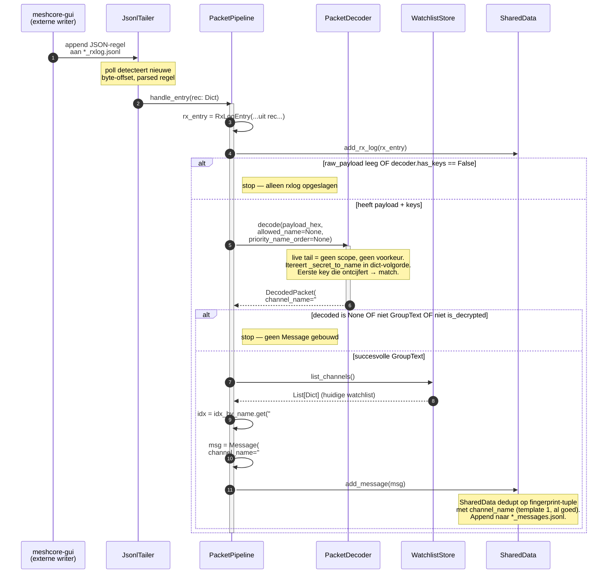
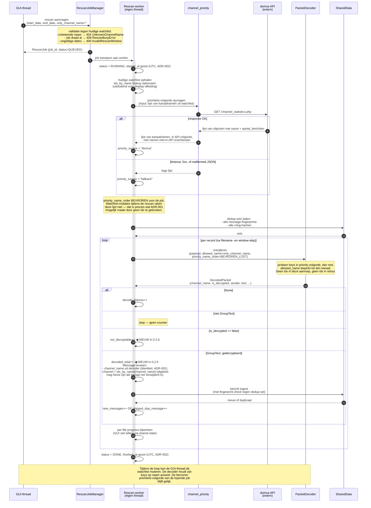

# Ontwerp 0.2.6 — naam-leidend door rescan, decoder en API

> **`channel_name` is de stabiele identiteit van een kanaal. `idx`
> is een vluchtige UI-positie in de watchlist en heeft nergens een
> rol als identiteit, sleutel, of selector buiten het renderen van
> een huidige snapshot.** (ADR-001)

| Veld     | Waarde                                                |
|----------|-------------------------------------------------------|
| Status   | Concept — wacht op review-akkoord                     |
| Scope    | meshcore-watchlist v0.2.6                             |
| Baseline | v0.2.4 (productie op de Pi, 1 mei 2026)               |
| ADRs     | ADR-001, ADR-002, ADR-003, ADR-004, ADR-005           |

---

## 1. Begrippenlijst (ontwerp-specifiek)

Aanvullend op de begrippenlijst in de opdracht-MD:

- **decode-pad** — de keten van componenten die een binnenkomend
  packet verwerkt, van JSONL-regel tot opgeslagen `Message`.
- **priority order** — de volgorde waarin de decoder kanaalkeys
  probeert. Bij live tail: dict-volgorde (geen voorkeur). Bij rescan:
  domca-API-volgorde, met de rest erachter aan.
- **allowed_name / only_channel_name** — scope-restrictie tot één
  kanaal. Wordt gebruikt door per-channel rescan; bij full rescan
  en bij live tail is hij `None`.
- **bevroren prioriteits-volgorde** — de `priority_name_order` wordt
  bij job-start vastgesteld en blijft tijdens de hele job gelijk,
  ongeacht watchlist-mutaties. De *keys* daarentegen volgen
  watchlist-mutaties wél (via `_on_watchlist_changed`). Beide
  beslissingen volgen uit ADR-001 en zijn gemotiveerd in §6.

---

## 2. Componenten en verantwoordelijkheden

| Component             | Bestand                              | Verantwoordelijkheid                                    |
|-----------------------|--------------------------------------|---------------------------------------------------------|
| `JsonlTailer`         | `services/jsonl_tailer.py`           | Polled `*_rxlog.jsonl` van meshcore-gui, parsed regels, callback per regel. **Ongewijzigd in 0.2.6.** |
| `PacketPipeline`      | `main.py`                            | Brug tussen tailer en rest. `handle_entry()` per regel; bouwt RxLogEntry, roept decoder, bouwt Message. **Aangepast: gebruikt `channel_name` als identiteit, leidt `channel` (idx) af voor display.** |
| `PacketDecoder`       | `decoder/packet_decoder.py`          | Houdt key-tabel bij. `decode()` retourneert `DecodedPacket` met `channel_name`. **Aangepast: `_secret_to_name`, `add/remove_channel_key(name, ...)`, `decode(..., allowed_name=, priority_name_order=)`. Geen idx in/uit.** |
| `WatchlistStore`      | `services/watchlist_store.py`        | Bron van waarheid voor de watchlist (lijst van kanaal-dicts). Notify-mechanisme bij wijziging. **Ongewijzigd.** |
| `SharedData`          | `core/shared_data.py`                | Thread-safe state: messages, rxlog, fingerprints, watchlist-cache. **Ongewijzigd in dit ontwerp** (template 1 uit 0.2.5 had de fingerprint-bug al opgelost). |
| `ArchiveRescanner`    | `services/archive_rescanner.py`      | Rescan-worker. **Aangepast: scoped op `only_channel_name`, geeft `priority_name_order` mee aan decoder, roept tellers `decoded_total` en `not_decryptable`.** |
| `RescanJobManager`    | `services/archive_rescanner.py`      | Submit/queue/status van rescan-jobs. **Aangepast: `submit(only_channel_name=)`, valideert tegen huidige watchlist op submit-tijd.** |
| `channel_priority`    | `services/channel_priority.py`       | Bevraagt domca-API. **Aangepast: `fetch_priority_name_order(watchlist_names)` retourneert `List[str]`.** |
| REST API              | `api/`                               | **Aangepast: `/rescan/{idx}` weg, `/rescan/by-name?channel_name=` erbij.** |
| GUI per-row knop      | `gui/panels/`                        | **Aangepast: stuurt `channel_name`, niet idx.** |
| GUI voortgangslabel   | `gui/panels/`                        | **Aangepast: nieuwe tellers zichtbaar.**             |

---

## 3. Sequence diagram — het decode-pad (live tail, 0.2.6)

Dit is het pad dat in productie ongeveer 99% van de tijd actief is.
Het diagram toont hoe een binnenkomend packet uit de meshcore-gui-
JSONL eindigt als opgeslagen `Message`. Het toont ook expliciet welke
identiteit (`channel_name`) en welke afgeleide (`channel` = idx) is.

### 3.1 Wat dit diagram bewijst

- **De decoder weet niets van idx.** In stap 6 gaat alleen
  `payload_hex` plus naam-gebaseerde parameters naar binnen, en
  alleen `channel_name` plus payload-velden komen eruit.
- **De idx-lookup gebeurt op één plek, na het decoderen, voor
  display.** Stap 11–12. Als de gebruiker net dat kanaal heeft
  verwijderd, is `idx` simpelweg `None` — het bericht wordt nog
  steeds bewaard, maar zonder positie-context.
- **Het pad is bit-voor-bit identiek aan 0.2.4 voor de externe
  observer.** Dezelfde regel JSONL erin produceert dezelfde regel
  in `*_messages.jsonl` eruit. Het verschil zit in de richting van
  de afleiding (in 0.2.4: idx is identiteit, naam afgeleid; in
  0.2.6: naam is identiteit, idx afgeleid).

### 3.2 Verschil met 0.2.4 / 0.2.5

| Aspect                          | 0.2.4 (baseline)                 | 0.2.5 (fout)                            | 0.2.6 (dit ontwerp)                       |
|---------------------------------|----------------------------------|-----------------------------------------|-------------------------------------------|
| `decoder.decode(...)` parameters| `payload_hex` only               | `payload_hex`, `priority_idx_order`     | `payload_hex`, `allowed_name`, `priority_name_order` |
| `DecodedPacket`-uitvoerveld     | `channel_idx: int`               | `channel_idx: int`                      | `channel_name: str`                       |
| Decoder-key-tabel               | `_secret_to_idx: Dict[str, int]` | idem                                    | `_secret_to_name: Dict[str, str]`         |
| Pipeline lookup-richting        | `name = name_by_idx[idx]`        | idem                                    | `idx = idx_by_name[name]` (omgekeerd)    |
| `Message.channel_name`          | optionele attributie             | optionele attributie                    | primaire identiteit                       |
| `Message.channel` (idx)         | primaire identiteit              | primaire identiteit                     | afgeleide voor display, mag `None` zijn  |

### 3.3 Wat dit diagram **niet** toont (en bewust niet)

- De rescan-flow. Die heeft een eigen diagram in §3a — daar zaten
  alle bugs van 0.2.5.
- De interne werking van de tailer-poll. Die is niet onderdeel van
  deze fix.

---

## 3a. Sequence diagram — het rescan-pad (0.2.6)

Dit is waar de bugs uit 0.2.5 zaten. Het diagram toont het volledige
pad: van submit, via prioriteits-volgorde-fetch, door de hoofdloop
met de decoder-aanroep, tot afronding. Het toont expliciet welke
parameters naam-gebaseerd zijn (decoder-aanroep), welke lijst voor
de duur van de job bevroren wordt (priority order) en welke kennis
juist live wordt bijgehouden (de decoder-keys).

### 3a.1 Wat dit diagram bewijst

- **De decoder krijgt geen idx te zien.** Niet als parameter, niet
  als retourwaarde, nergens. Dat is de directe toepassing van
  ADR-001 op de plek waar de bug zat.
- **De prioriteits-volgorde leeft in de job, de keys leven in de
  decoder.** Twee verschillende dingen, twee verschillende
  levensduren. Een rescan-job heeft één bevroren priority order
  voor zijn hele looptijd; de decoder-key-tabel volgt
  watchlist-mutaties op de voet. Dit is de splitsing die in 0.2.5
  niet bestond — daar werd alles samen bevroren als één
  idx-gebaseerde lijst, en herordening tijdens de rescan brak
  daardoor de mapping.
- **`only_channel_name` wordt op submit-tijd gevalideerd.** Niet
  op job-start (zie §9.2 — beslispunt voor de review).
- **De drie nieuwe tellers maken de "+0 msgs"-diagnose mogelijk.**
  `decoded_total` zegt of de decoder werk verzet, `not_decryptable`
  zegt of er records zijn waar geen key voor is, en `new_messages`
  zegt wat er nieuw in archive komt. Met die drie naast elkaar is
  op het scherm te zien of "+0 new" betekent "alles werkte, niets
  was nieuw" of "niets werkte".
- **Concurrency tijdens de loop, in detail.** De GUI-thread mag
  vrijuit watchlist-mutaties doen tijdens een lopende rescan.
  Toevoegen van een kanaal: de decoder krijgt de nieuwe key,
  records die daarna verwerkt worden kunnen ermee gedecodeerd
  worden. Verwijderen: de key wordt uit de decoder gehaald,
  records voor dat kanaal vallen vanaf dat moment onder
  not-decryptable. Herordenen: heeft geen enkel effect — er is
  geen idx-binding meer waar de rescan op steunt. Dit is precies
  het gedrag dat ADR-001 mogelijk maakt door geen idx als
  identiteit te gebruiken.

### 3a.2 Verschil met 0.2.5

| Aspect                              | 0.2.5 (fout)                                          | 0.2.6 (dit ontwerp)                              |
|-------------------------------------|-------------------------------------------------------|--------------------------------------------------|
| RescanJob scope-veld                | `only_channel_idx`                                    | `only_channel_name`                              |
| Prioriteits-lijst type              | lijst van idx-waarden, bevroren                       | lijst van namen, bevroren                        |
| Decoder-aanroep parameters          | `allowed_idx`, `priority_idx_order`                  | `allowed_name`, `priority_name_order`            |
| Decoder-retourveld                  | `channel_idx`                                         | `channel_name`                                   |
| Watchlist-mutatie tijdens rescan    | breekt mapping (idx wijst naar verkeerd kanaal)       | geen effect op job-scope of priority order       |
| Per-record diagnose                 | alleen `new_messages` zichtbaar                       | `decoded_total` + `not_decryptable` + `new_messages` |
| API endpoint per kanaal             | `POST /api/v1/rescan/{idx}`                          | `POST /api/v1/rescan/by-name?channel_name=...`  |

### 3a.3 Wat dit diagram **niet** toont (en bewust niet)

- De interne iteratie van `_handle_line` over alle keys in een
  bepaalde volgorde. Dat is gedrag dat in §6.1 op gedragsniveau
  beschreven is; het diagram zou onleesbaar worden als die loop
  zichtbaar werd.
- De file-discovery-stap (filename-window-skip). Die zit als
  vooraf-filter rond de hoofdloop maar voegt aan het identiteits-
  verhaal niets toe. Beschreven in §5.4.
- Het live-tail-pad. Dat staat in §3 en is in deze release niet
  inhoudelijk gewijzigd.

---

## 4. Data dictionary

Velden gemarkeerd **fix** veranderen in 0.2.6; de rest staat ter
referentie.

### 4.1 `Message` (`core/models.py`)

| Veld           | Type                | Verplicht | Identiteit?      | Beschrijving |
|----------------|---------------------|-----------|------------------|--------------|
| `channel_name` | `str`               | ja        | **ja — primair** **fix** | Naam van het kanaal waarvan de key matchde. Stabiel over watchlist-mutaties. |
| `channel`      | `Optional[int]`     | nee       | nee — afgeleid   | Idx in de watchlist op moment van ingest. Mag `None` (kanaal net verwijderd). Uitsluitend voor display-compatibiliteit met meshcore-gui-payload-shape. |
| `sender`       | `str`               | ja        | nee              | Sender-naam uit packet. |
| `text`         | `str`               | ja        | nee              | Bericht-tekst. |
| `message_hash` | `str`               | ja        | nee              | Hash uit packet, gebruikt in fingerprint. |
| `time`         | `str`               | ja        | nee              | Tijdstip in `YYYY-MM-DDTHH:MM:SSZ` (ADR-002). |
| `snr`          | `float`             | nee       | nee              | Signal-to-noise. |
| `path_len`     | `int`               | nee       | nee              | Hops. |
| `path_hashes`  | `List[str]`         | nee       | nee              | Hashes uit packet path. |
| `path_names`   | `List[str]`         | nee       | nee              | Namen uit RxLogEntry, niet uit decode. |

Fingerprint-tuple voor dedup: `(channel_name, sender, text, message_hash)`. Was in 0.2.5 al rechtgezet (template 1). **Geen `channel` (idx) in de tuple.**

### 4.2 `DecodedPacket` (`decoder/packet_decoder.py`)

| Veld            | Type             | Verplicht | Identiteit?      | Beschrijving |
|-----------------|------------------|-----------|------------------|--------------|
| `message_hash`  | `str`            | ja        | nee              | Hash uit packet. |
| `payload_type`  | `PayloadType`    | ja        | nee              | Enum; alleen `GroupText` triggert Message-aanmaak. |
| `path_length`   | `int`            | ja        | nee              | Hops. |
| `path_hashes`   | `List[str]`      | ja        | nee              | Hashes uit packet path. |
| `sender`        | `str`            | nee       | nee              | Default `""`. |
| `text`          | `str`            | nee       | nee              | Default `""`. |
| `channel_name`  | `str`            | ja        | **ja — primair** **fix** | Naam van het kanaal waarvan de key matchde. Default `""` als niet decrypted. |
| `timestamp`     | `int`            | nee       | nee              | Default 0. |
| `is_decrypted`  | `bool`           | ja        | nee              | False als geen key matchde. |

**Geschrapt t.o.v. 0.2.5:** `channel_idx: int`.

### 4.3 `RescanJob` (`services/archive_rescanner.py`)

| Veld                 | Type              | Verplicht | Identiteit? | Beschrijving |
|----------------------|-------------------|-----------|-------------|--------------|
| `job_id`             | `str`             | ja        | ja — primair | UUID4 string. |
| `start_date`         | `str`             | ja        | nee         | `YYYY-MM-DD` UTC, inclusief (ADR-002). |
| `end_date`           | `str`             | ja        | nee         | `YYYY-MM-DD` UTC, inclusief (ADR-002). |
| `only_channel_name`  | `Optional[str]`   | nee       | nee         | **fix** Scope-restrictie. `None` = alle kanalen. |
| `priority_source`    | `str`             | ja        | nee         | `"domca"` of `"fallback"`. |
| `status`             | `RescanStatus`    | ja        | nee         | Enum: QUEUED, RUNNING, DONE, FAILED. |
| `started_at`         | `Optional[str]`   | nee       | nee         | `YYYY-MM-DDTHH:MM:SSZ` (ADR-002). |
| `finished_at`        | `Optional[str]`   | nee       | nee         | `YYYY-MM-DDTHH:MM:SSZ` (ADR-002). |
| `files`              | `List[FileProgress]` | ja     | nee         | Per-file voortgang. |
| `new_messages`       | `int`             | ja        | nee         | Nieuw geschreven naar archive. |
| `skipped_dup_message`| `int`             | ja        | nee         | Gedecodeerd, fingerprint zat al in archive. |
| `decoded_total`      | `int`             | ja        | nee         | **fix** GroupText succesvol ontcijferd (= new + skipped_dup). |
| `not_decryptable`    | `int`             | ja        | nee         | **fix** GroupText, geen key matchde. |
| `new_rxlog`          | `int`             | ja        | nee         | Nieuwe rxlog-records. |
| `skipped_dup_rxlog`  | `int`             | ja        | nee         | Rxlog-fingerprint zat al in archive. |
| `skipped_window`     | `int`             | ja        | nee         | Timestamp buiten venster. |
| `skipped_files`      | `int`             | ja        | nee         | Filename-datum buiten venster. |
| `decode_failures`    | `int`             | ja        | nee         | Structureel ongeldig packet. |
| `error`              | `Optional[str]`   | nee       | nee         | Foutboodschap als status = FAILED. |

**Geschrapt t.o.v. 0.2.5:** `only_channel_idx: Optional[int]`.

### 4.4 Domca-API responsschema

`GET https://www.domca.nl/api/meshcore/channel_statistics.php` →
`List[Dict]`. Per element:

| Veld                | Type    | Gebruikt? | Reden                              |
|---------------------|---------|-----------|-----------------------------------|
| `name`              | `str`   | ja        | Kanaalnaam, basis van prioriteit. |
| `aantal_berichten`  | `int`   | ja        | Sorteersleutel (descending). |
| `first_received_at` | `str`   | **nee**   | Server-side cumulatief timestamp; sluit niet aan bij rescan-window-semantiek. |
| `last_received_at`  | `str`   | **nee**   | Idem. |

### 4.5 Archive JSONL

`*_messages.jsonl` en `*_rxlog.jsonl` — één record per regel, JSON-
geserialiseerde Message resp. RxLogEntry. Schema staat in
`core/models.py`. **Geen schema-wijziging in 0.2.6** —
`Message.channel_name` is verplicht aanwezig sinds 0.2.0,
`Message.channel` blijft als optioneel int-veld bestaan.

---

## 5. Foutpaden

### 5.1 Decoder

| Conditie                              | Gedrag                                       |
|---------------------------------------|----------------------------------------------|
| `payload_hex` ongeldig (parse-error)  | Return `None`. Geen exception. |
| Geen key matcht                       | Return `DecodedPacket(is_decrypted=False, channel_name="")`. |
| `allowed_name` niet in `_secret_to_name` | Return `None`. Geen exception, geen warning. |
| Malformed packet (geen GroupText)     | Return `DecodedPacket` met `payload_type` ≠ GroupText. Caller filtert. |

### 5.2 RescanJobManager.submit

| Conditie                                  | Exception                       | HTTP-status |
|-------------------------------------------|---------------------------------|-------------|
| `start_date` of `end_date` ongeldig formaat / ontbreekt | `InvalidRescanWindow`     | 400         |
| `only_channel_name` niet `None` en niet in watchlist     | `UnknownChannelName`      | 404         |
| Er loopt al een job                       | `RescanBusyError`               | 409         |

### 5.3 channel_priority

`fetch_priority_name_order` vangt **alle** netwerk- en parse-fouten
af en retourneert lege lijst (`[]`). De rescanner ziet dan `[]`,
zet `priority_source = "fallback"` op de job, en gebruikt
watchlist-volgorde. Geen exception bubblet op naar
`RescanJobManager._worker`. Geen failed status alleen omdat domca
down is.

| Conditie                              | Resultaat                            |
|---------------------------------------|--------------------------------------|
| `socket.timeout`                      | `[]`                                 |
| HTTP 5xx                              | `[]`                                 |
| HTTP 4xx                              | `[]`                                 |
| Malformed JSON                        | `[]`                                 |
| JSON-array maar element zonder `name` | element overslaan, rest gebruiken    |

### 5.4 ArchiveRescanner._handle_line

| Conditie                              | Gedrag                                                |
|---------------------------------------|-------------------------------------------------------|
| `decoder.decode(...)` retourneert `None` | `job.decode_failures += 1`, return.                |
| Niet-GroupText                        | Return zonder counter (niet relevant).               |
| `is_decrypted == False`               | `job.not_decryptable += 1`, return.                  |
| Succes, in dedup-set                  | `job.decoded_total += 1`, `job.skipped_dup_message += 1`, return. |
| Succes, niet in dedup-set             | `job.decoded_total += 1`, `job.new_messages += 1`, write naar archive. |

### 5.5 REST API

| Endpoint                                           | Conditie                       | HTTP-status | Body                                |
|----------------------------------------------------|--------------------------------|-------------|-------------------------------------|
| `POST /api/v1/rescan`                              | dates ontbreken/ongeldig       | 400         | `{"error": "invalid_rescan_window"}` |
| `POST /api/v1/rescan/by-name`                      | `channel_name` ontbreekt       | 400         | `{"error": "missing_channel_name"}` |
| `POST /api/v1/rescan/by-name`                      | naam niet in watchlist         | 404         | `{"error": "channel_name_not_in_watchlist"}` |
| `POST /api/v1/rescan` of `/by-name`                | job loopt al                   | 409         | `{"error": "rescan_busy"}` |
| `POST /api/v1/rescan/{idx}`                        | endpoint vervallen             | 404         | (Flask default)                     |
| `GET /api/v1/rescan/{job_id}`                      | onbekend job_id                | 404         | `{"error": "unknown_job"}` |

---

## 6. Ontwerpkeuzes met alternatieven

### 6.1 Bevroren `priority_name_order` per job, levende `_secret_to_name`

**Keuze.** Bij job-start wordt `priority_name_order` één keer
opgehaald (domca-API of fallback) en bevroren voor de duur van de
job. De keys zelf in `_secret_to_name` blijven daarentegen actueel
via `_on_watchlist_changed` (add/remove).

**Alternatief.** Volledig bevriezen (priority + keys) bij job-start.
Afgewezen: dan zou een kanaal dat tijdens de rescan wordt toegevoegd
niet meer gedecodeerd worden, ook niet in records die tijdens de
job worden verwerkt. Dat is gedragsverlies zonder winst.

**Alternatief.** Beide live volgen. Afgewezen: de prioriteits-
volgorde is een optimalisatie (probeer waarschijnlijke keys eerst).
Hem tijdens de job aanpassen geeft niet meer correctheid, alleen
meer ruis in de tellers en in de logs (een record kan dan halverwege
de job een andere "winnende positie" krijgen). KISS (ADR-005): de
keuze die minder beweegt en niet minder correct is, wint.

### 6.2 `Message.channel` blijft als veld bestaan

**Keuze.** Het `channel: Optional[int]` veld blijft in `Message`,
in archive-JSONL en in API-output, maar wordt afgeleid uit
`channel_name` op moment van ingest.

**Alternatief.** Veld schrappen. Afgewezen: dat is een breaking
change voor de archive-schema (nieuwe records zonder `channel`,
oude records met `channel`) en voor externe consumers die de
JSONL-archives lezen. Geen winst tegen de kosten.

**Alternatief.** Veld verplicht houden, geen `None` toestaan.
Afgewezen: er bestaat een legitiem geval waarin de naam niet meer
in de watchlist staat (bv. kanaal verwijderd tussen decode en
ingest). Dan is geen `idx` beschikbaar. `None` reflecteert die
realiteit eerlijk; een sentinel-waarde als `-1` zou hetzelfde doen
maar minder leesbaar.

### 6.3 `POST /api/v1/rescan/by-name` met query-parameter, niet path-parameter

**Keuze.** `?channel_name=%23test` als query-parameter, met
`#` URL-encoded als `%23`.

**Alternatief.** Path-parameter `/rescan/by-name/{channel_name}`.
Afgewezen: een `#` in een URL-pad is ambigu (kan als fragment-marker
gelezen worden door tussenliggende proxies/clients). Query-parameters
zijn voor dit soort kanaal-namen veiliger en eenvoudiger te
documenteren.

**Alternatief.** Body-parameter (JSON POST body). Afgewezen:
inconsistent met de andere rescan-endpoints die query-parameters
gebruiken voor `start_date`/`end_date`.

### 6.4 Geen `_handle_line`-aanpassing voor de ingest-richting

**Keuze.** `ArchiveRescanner._handle_line` blijft de `Message`
opbouwen en doorgeven aan `SharedData.ingest_rescanned_message`,
zoals nu. Wijziging is alleen: `channel_name` als primaire input,
`channel` (idx) afgeleid.

**Alternatief.** Een aparte ingest-methode voor rescan-vs-live-tail.
Afgewezen: SOLID/KISS (ADR-005). Beide paden produceren een
`Message` met identieke shape; de fingerprint-check is identiek.
Eén ingest-API met twee callers is correct en simpel; twee APIs
met overlap is duplicatie.

---

## 7. Threading

Drie threads, alle drie communiceren via `SharedData` en/of
`WatchlistStore`:

| Thread        | Eigenaar              | Wat doet hij                                            |
|---------------|------------------------|---------------------------------------------------------|
| GUI           | NiceGUI                | UI-events, voortgang renderen, watchlist-mutaties.      |
| Live tail     | `JsonlTailer._run`     | Polled JSONL, callback naar `PacketPipeline.handle_entry`. |
| Rescan-worker | `RescanJobManager._worker` | Verwerkt rescan-jobs uit de queue, één tegelijk.        |

**Concurrency-eis (ADR-001-conform):** een watchlist-mutatie tijdens
een lopende rescan mag het scan-resultaat niet beïnvloeden.

- De rescan-worker leest `priority_name_order` uit zijn eigen
  bevroren job-state (zie 6.1).
- De decoder gebruikt `_secret_to_name` voor key-matching; deze
  wordt door GUI-thread bijgewerkt via `_on_watchlist_changed`.
  Een bericht dat halverwege een rescan binnenkomt op een net
  toegevoegd kanaal wordt nog steeds correct gedecodeerd.
- Een verwijderd kanaal: de key uit `_secret_to_name` weghalen
  (`remove_channel_key(name)`), zodat het kanaal niet meer in de
  decoder-loop meedoet.

Locking blijft zoals `SharedData` het nu organiseert (RLock per
sectie). Geen nieuwe locks geïntroduceerd.

---

## 8. Reviewbaarheid

- Sequence diagram in §3 — in mermaid, in dit document, geen
  externe afbeelding.
- Data dictionary in §4 — in dit document, geen "zie code".
- Foutpaden in §5 — expliciete tabellen met conditie en gevolg.
- Methode-namen en hun handtekeningen worden hierboven in proza
  benoemd (waar relevant); de definitieve Python-signatures staan
  in een apart contract-document dat na review-akkoord wordt
  geleverd. **In dit ontwerp staan ze bewust niet.** Het ontwerp
  beschrijft het *gedrag* en de *contracten op betekenis*, niet
  de syntax.

---

## 9. Te beslissen tijdens review

1. **Filename-datum-skip in rescan.** Het ontwerp-MD van de opdracht
   verwijst hiernaar (template 2 uit 0.2.5). Hier alleen genoemd
   voor volledigheid; niet veranderd door dit ontwerp.
2. **`only_channel_name` validatie-moment.** Op submit-tijd, niet
   op job-start. Als een gebruiker het kanaal verwijdert ná submit
   maar vóór de worker de job pakt, wordt de job alsnog uitgevoerd
   maar zonder match (alle records vallen onder `not_decryptable`).
   Alternatief: bij job-start opnieuw valideren en de job laten
   falen. **Voorkeur: op submit-tijd. Als jij de andere wilt, wijzig
   ik dit.**
3. **Voortgangslabel in GUI.** Twee voorstellen in opdracht-MD §6.9.
   **Voorkeur: de compactere variant.** De inhoud is wat telt;
   ruimte op het scherm beperkt.

---

## 10. Wat na review-akkoord komt

Drie deliverables in deze volgorde:

1. **Contract-document** — Python-signatures voor decoder, RescanJob,
   manager, rescanner, channel_priority, REST API. Een-op-een
   afleidbaar uit dit ontwerp.
2. **Implementatie** — code conform contract.
3. **Zip + CHANGELOG** — finale oplevering.

Niet beginnen aan stap 1 voordat dit document expliciet is
goedgekeurd. Stilte is geen akkoord (opdracht-MD §3).
